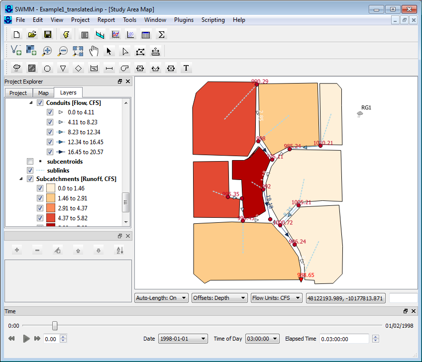
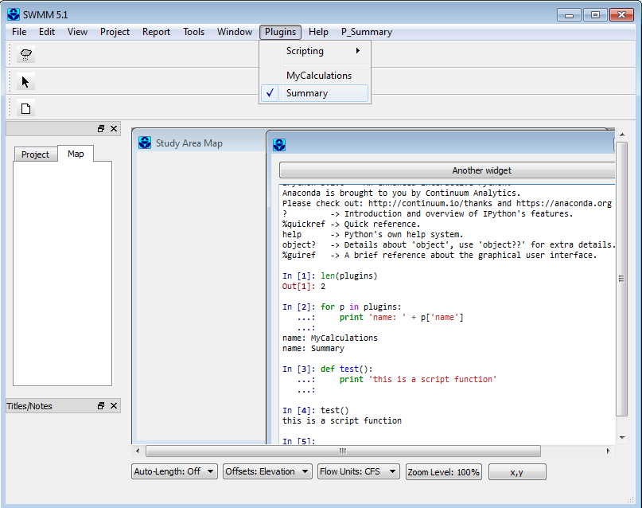
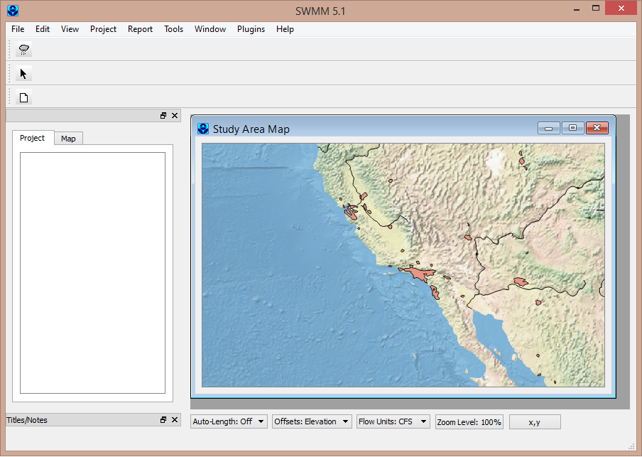
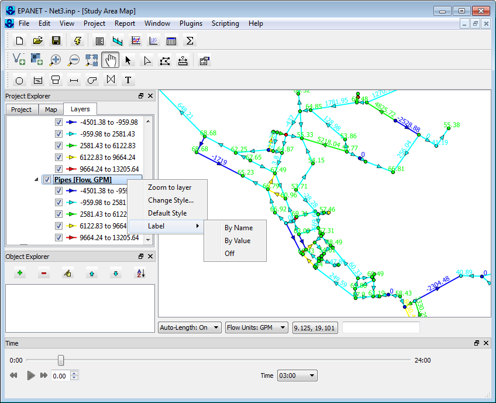

# SWMM 5.2.4 Python GUI

A Python-based graphical user interface for **EPA SWMM 5.2** (Storm Water Management Model) with integrated GIS mapping powered by QGIS. Forked from [USEPA/SWMM-EPANET_User_Interface](https://github.com/USEPA/SWMM-EPANET_User_Interface) and updated for modern Python/QGIS stacks.



## Features

- Full SWMM 5.2 model editing (nodes, links, subcatchments, options, controls)
- Interactive GIS map canvas with pan, zoom, and spatial editing via QGIS
- Profile plot visualization with HGL animation and time-step playback
- INP file import/export with full round-trip fidelity
- EPANET water-distribution modeling (shared codebase)
- Plugin system for extensible custom tools
- GIS import/export (Shapefile) for nodes, links, and subcatchments
- Coordinate translation and CRS projection support

## Requirements

| Dependency | Version |
|------------|---------|
| Python | 3.12+ |
| QGIS | 3.0.3+ (provides PyQt5, GDAL, and GIS libraries) |
| matplotlib | 3.4+ |
| swmm-toolkit | 0.15+ (optional, for output reading via SWIG API) |

> QGIS ships with its own Python 3.12 and PyQt5 via the OSGeo4W distribution on Windows. The launcher script (`run_swmm.bat`) auto-detects the QGIS installation and configures the environment.

## Quick Start

### Windows

1. Install [QGIS](https://qgis.org/download/) (LTR or latest stable).
2. Clone this repository:
   ```
   git clone https://github.com/JoaquinAlvarado-py/SWMM-5.2.4-Python.git
   cd SWMM-5.2.4-Python
   ```
3. Run the application:
   ```
   run_swmm.bat
   ```

The batch file will:
- Auto-detect your QGIS installation in `C:\Program Files\QGIS*`
- Initialize the OSGeo4W environment
- Launch the SWMM GUI using QGIS's bundled Python

### Manual Launch

If you need to launch manually or from a non-standard QGIS path:

```bash
# Set QGIS environment first (adjust paths to your installation)
call "C:\Program Files\QGIS 3.38\bin\o4w_env.bat"
set QGIS_PREFIX_PATH=C:/OSGeo4W/apps/qgis-ltr
set PYTHONPATH=./src;%QGIS_APP%/python

cd src
python ui/SWMM/frmMainSWMM.py
```

## Project Structure

```
.
├── src/
│   ├── core/                  # Data models and INP file I/O
│   │   ├── swmm/              #   SWMM project model, readers, writers
│   │   │   ├── hydrology/     #     Subcatchments, rain gages, infiltration, LID
│   │   │   ├── hydraulics/    #     Nodes, links, controls, cross-sections
│   │   │   └── options/       #     Simulation options, dates, time steps
│   │   └── epanet/            #   EPANET project model (water distribution)
│   ├── ui/                    # PyQt5 GUI layer
│   │   ├── SWMM/              #   SWMM-specific dialogs and main window
│   │   ├── EPANET/            #   EPANET-specific dialogs and main window
│   │   ├── map_tools.py       #   GIS map canvas tools (3,600+ LOC)
│   │   └── frmMain.py         #   Shared base application window
│   ├── Externals/             # C library wrappers (ctypes)
│   │   ├── swmm/              #   SWMM engine DLL + output API
│   │   └── epanet/            #   EPANET engine DLL + output API
│   └── plugins/               # Extensible plugin modules
│       └── Summary/           #   Report generation plugins
├── test/                      # Unit and integration tests
├── doc/                       # Documentation
├── run_swmm.bat               # Windows launcher (auto-detects QGIS)
└── CHANGELOG.md               # Version history
```

## Architecture

The application follows a **Model-View** pattern:

- **Core** (`src/core/`): Pure-Python data models that mirror the INP file format. Each SWMM section (junctions, conduits, subcatchments, options, etc.) has a corresponding class. Readers parse INP text into objects; writers serialize objects back to INP.
- **UI** (`src/ui/`): PyQt5 windows and dialogs. A shared `frmMain` base class handles project lifecycle, menus, and plugin loading. SWMM and EPANET each extend this with their own main window and editors.
- **Map** (`src/ui/map_tools.py`): QGIS integration for spatial editing. Nodes render as points, links as polylines, subcatchments as polygons. Supports pan, zoom, select, move, vertex editing, and coordinate transformation.
- **Externals** (`src/Externals/`): Thin ctypes wrappers around the SWMM and EPANET C simulation engines and output file APIs.

## Screenshots

| SWMM Model Editing | Map with Relief Backdrop |
|:---:|:---:|
|  |  |

| EPANET Interface |
|:---:|
|  |

## Recent Changes

### 2026-04-14

- SWMM 5.2 + Python 3.12 compatibility
- matplotlib 3.4+ compatibility fixes (`set_window_title`, `get_cmap`)
- swmm-toolkit v0.15+ shim corrections
- Profile Plot overhaul: rectangular junction boxes, crown/invert pipe lines, HGL animation with playback controls, dynamic units (m/ft), link offset support

See [CHANGELOG.md](CHANGELOG.md) for full history.

## Running Tests

```bash
cd src
python -m pytest ../test/
```

Or using the HTML test runner:

```bash
cd test
python core/swmm/swmmregressiontest.py
```

## Contributing

1. Fork this repository
2. Create a feature branch (`git checkout -b feature/my-feature`)
3. Commit your changes
4. Push and open a pull request

## License

This project is licensed under the MIT License. See [LICENSE](LICENSE) for details.

## Acknowledgments

- Original codebase by [US EPA](https://github.com/USEPA/SWMM-EPANET_User_Interface)
- SWMM engine by US EPA Office of Research and Development
- GIS integration via [QGIS](https://qgis.org/) and PyQt5

## EPA Disclaimer

*The United States Environmental Protection Agency (EPA) GitHub project code is provided on an "as is" basis and the user assumes responsibility for its use. EPA has relinquished control of the information and no longer has responsibility to protect the integrity, confidentiality, or availability of the information. Any reference to specific commercial products, processes, or services by service mark, trademark, manufacturer, or otherwise, does not constitute or imply their endorsement, recommendation or favoring by EPA. The EPA seal and logo shall not be used in any manner to imply endorsement of any commercial product or activity by EPA or the United States Government.*
